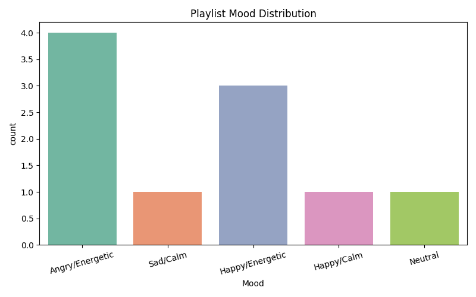

# 🎵 Spotify Playlist Mood Analyzer  

A data-driven project that analyzes songs from a Spotify dataset and classifies them into mood categories such as **Happy/Energetic, Happy/Calm, Angry/Energetic, Sad/Calm, and Neutral**.  
The project also provides a simple **visualization of mood distribution** within a randomly generated playlist.  

---

## 📌 Features
- Loads a Spotify songs dataset (`spotify_songs.csv`)
- Extracts relevant audio features:  
  - `danceability`  
  - `energy`  
  - `valence`  
  - `tempo`  
- Simulates a playlist by sampling random songs
- Assigns **mood labels** to each track based on energy and valence
- Generates a **bar chart** of mood distribution
- Saves visualization in the `plots/` folder

---

## 🛠️ Tech Stack
- **Python 3.8+**
- **Pandas** – data manipulation  
- **Matplotlib** – plotting  
- **Seaborn** – visualization  

---

## 🚀 How to Run

1. **Clone the repository**

   git clone https://github.com/<your-username>/spotify-playlist-mood-analyzer.git
   cd spotify-playlist-mood-analyzer

Install dependencies

pip install -r requirements.txt

Add the dataset

Place spotify_songs.csv inside the project folder.
(Dataset can be downloaded from Kaggle: Spotify Songs Dataset)

Run the script

python mood_analyzer.py

View output

Console will display playlist with mood labels

Mood distribution plot will be saved in plots/mood_distribution.png

📊 Example Output

Playlist with Mood Labels

       track_name      artist_name             Mood
0      Song A       Artist A        Happy/Energetic
1      Song B       Artist B        Sad/Calm
...

Mood Distribution Chart

📂 Project Structure

spotify-playlist-mood-analyzer/

│── mood_analyzer.py       # Main script

│── spotify_songs.csv      # Dataset (not included in repo)

│── requirements.txt       # Dependencies

│── plots/                 # Folder for output visualizations

│── README.md              # Project documentation

✅ Requirements File (requirements.txt)

pandas

matplotlib

seaborn

🌟 Future Improvements
Build a web app (Streamlit/Dash) for interactive playlist mood analysis

Add Spotify API integration for live playlist analysis

Improve classification with machine learning models

👨‍💻 Author
Developed by Jovin Ryan Samuel ✨
